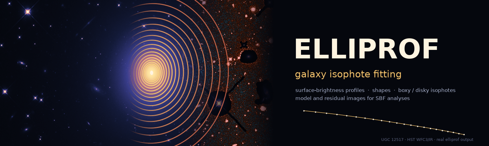

<p align="center">
  <a href="https://ekourkchi.github.io/elliprof/"></a>
</p>

<p align="center">
  <a href="https://github.com/ekourkchi/elliprof/actions/workflows/ci.yml"></a>
  <a href="https://github.com/ekourkchi/elliprof/actions/workflows/ci.yml"></a>
  <a href="https://github.com/ekourkchi/elliprof/blob/main/tests/original_source_hashes.txt"></a>
  <a href="https://github.com/ekourkchi/elliprof/actions/workflows/wheels.yml"></a>
  <a href="https://ekourkchi.github.io/elliprof/"></a>
  <br>
  <a href="https://pypi.org/project/elliprof/"></a>
  <a href="https://pypi.org/project/elliprof/"></a>
  <a href="#platforms"></a>
  <a href="https://pypi.org/project/elliprof/#files"></a>
  <a href="https://github.com/ekourkchi/elliprof/blob/main/LICENSE"></a>
</p>

# elliprof

**ELLIPROF is an astronomical isophote-fitting tool for measuring the radial surface-brightness and shape profiles of galaxies.** Given a FITS image and an initial galaxy centre, it fits a sequence of elliptical isophotes and measures, for each one, its intensity, centre, ellipticity, position angle, radial intensity slope, and the 3rd- and 4th-order harmonic deviations from a pure ellipse. It can also build a smooth model image of the galaxy from the fitted isophotes.

`elliprof` packages the original ELLIPROF Fortran, compiled unchanged, as a command-line program and a Python library.

Documentation: <https://ekourkchi.github.io/elliprof/>

Source code and issue tracker: <https://github.com/ekourkchi/elliprof>

## What it is for

ELLIPROF is intended primarily for galaxy images. It is particularly useful for:

- elliptical galaxies, smooth spheroidal systems and galaxy bulges, and other smooth light distributions;
- surface-brightness profiles, and how ellipticity and position angle change with radius (isophote twists);
- departures from pure elliptical isophotes, in particular the 4th-order term that characterizes **boxy** or **disky** isophotes.

It describes a galaxy as a set of nested ellipses, so it is not necessarily the best tool for irregular galaxies or strongly structured light (spiral arms, bars, dust lanes, bright clumps). Stars and other contaminants should be masked.

**You supply the initial galaxy centre** (`X0`, `Y0`). elliprof does not find the galaxy centre for you. Starting from your centre, ELLIPROF refines the centre of every isophote as part of its normal fit.

## Installation

```sh
python -m pip install elliprof
```

- Prebuilt wheels are provided for Linux, macOS and Windows.
- No Fortran compiler and no separate CFITSIO installation are needed.

Check the installation:

```sh
elliprof            # a short introduction
elliprof -v         # version (also --version)
elliprof -h         # full help: parameters, options and examples (also --help)
```

### Compatibility

Python and the operating system are separate requirements: a supported Python on an unsupported OS version still cannot install elliprof.

**Supported Python:** 3.6 through 3.14.

**Supported macOS:**
- Intel (x86_64): macOS 10.13 High Sierra or newer
- Apple Silicon (arm64): macOS 11 Big Sur or newer (the first macOS for Apple Silicon)

**Supported Linux and Windows:** see [Platforms](#platforms).

### If pip says "No matching distribution found"

This message means pip found no elliprof build that fits your computer. The usual reasons are:

- a Python older than 3.6,
- an old pip that does not recognize current package names,
- an operating system older than the minimum above,
- a processor type with no elliprof build (for example 32-bit systems).

University and observatory computers often have an old Python or an old pip. First check what you have:

```sh
python --version
python -m pip --version
uname -m        # x86_64 = Intel, arm64 = Apple Silicon
sw_vers         # macOS only: the macOS version
```

On a Mac, Intel and Apple Silicon have different minimums: Intel needs macOS 10.13 or newer, Apple Silicon macOS 11 or newer.

**If Python is 3.6–3.14**, upgrade pip and try again:

```sh
python -m pip install --upgrade pip
python -m pip install elliprof
```

On Python 3.6, the newest pip is 21.3.1:

```sh
python -m pip install "pip==21.3.1"
python -m pip install elliprof
```

Very old pip versions do not recognize the platform tags of current wheels (pip 20.3 or newer is needed), and then report "No matching distribution found" even though a wheel exists.

**If Python is older than 3.6**, do not replace your system Python. Create a separate environment instead; this does not modify your existing astronomy environment. With conda:

```sh
conda create -n elliprof python=3.12 pip -y
conda activate elliprof
python -m pip install --upgrade pip
python -m pip install elliprof
```

Or, if a newer Python is already installed, with `venv`:

```sh
python3.12 -m venv elliprof-env
source elliprof-env/bin/activate
python -m pip install --upgrade pip
python -m pip install elliprof
```

(Python 3.12 is only an example; any version from 3.6 to 3.14 works.)

**Several Pythons on one machine:** prefer `python -m pip install elliprof` to `pip install elliprof`. On shared systems the `pip` command may belong to a different Python than the one you run. Naming the interpreter makes sure the package is installed for it:

```sh
python3.9 -m pip install elliprof
python3.12 -m pip install elliprof
```

### NumPy 2 with an older Anaconda environment

If using elliprof prints messages such as "A module that was compiled using NumPy 1.x cannot be run in NumPy 2.x" or "_ARRAY_API not found", the problem is not elliprof. Its compiled part does not use NumPy. The messages come from older compiled packages already in that environment, usually `numexpr` or `bottleneck`, which pandas loads.

- `elliprof`, `elliprof -h`, `elliprof -v` and command-line fits do not load pandas, so they are not affected.
- The Python API returns the profile as a pandas table, so it needs pandas to work.

Update the old packages:

```sh
python -m pip install --upgrade numexpr bottleneck
```

(with Anaconda: `conda update numexpr bottleneck`). If they cannot be upgraded, go back to NumPy 1:

```sh
python -m pip install "numpy<2"
```

For a heavily aged environment, the safest solution is a fresh environment for elliprof (see above).

## Quick start

```sh
elliprof galaxy.fits \
    X0=500 Y0=500 \
    R0=5 R1=200 NR=30 \
    --csv profile.csv \
    --reg profile.reg
```

- `X0`, `Y0`: initial galaxy centre, in pixels (see [Coordinates](#coordinates)).
- `R0`, `R1`: the range of semi-major axes to fit, in pixels (0 < R0 < R1).
- `NR`: number of isophotes (2–100), including R0 and R1, spaced evenly in r^¼ by default (`RLAW=1` for logarithmic, `RLAW=0` for linear spacing).
- `profile.csv`: the radial profile, one row per isophote.
- `profile.reg`: the fitted ellipses as a DS9 region file. View them with `ds9 galaxy.fits -regions profile.reg`.

### Profile files and images

elliprof produces two different kinds of result:

- **The profile** (`-o profile.prf`, `--csv profile.csv`): numbers, one set per fitted isophote (radius, centre, intensity, position angle, ellipticity, harmonic terms, slope). The `.prf` is ELLIPROF's native profile format at full precision, with the run settings. **It is a table of numbers, not an image.** The CSV holds the same profile as a readable table.
- **Images** (FITS, float32):
  - **model** (`MODEL -m model.fits`): the galaxy reconstructed from the fitted isophotes. It follows the fitted intensity, centre, ellipticity and position angle with radius, plus the harmonic terms chosen with `--model-harmonics`. It is relative to the subtracted sky, and it covers masked pixels too.
  - **prepared** (`--prepared prepared.fits`): `mask × (science − sky)`, the image exactly as ELLIPROF fits it.
  - **residual** (`--residual residual.fits`): `mask × (science − sky − model)`. It is science − sky − model on good pixels and exactly 0 on masked ones. It uses the same model as `-m`; `-m` is not needed.

```sh
elliprof galaxy.fits \
    --mask mask.fits \
    --sky 1234.5 \
    X0=500 Y0=500 R0=5 R1=200 NR=30 \
    MODEL -m galaxy_model.fits \
    --prepared galaxy_prepared.fits \
    --residual galaxy_residual.fits \
    -o galaxy.prf
```

All three images carry the header of the science image, including its WCS (`CTYPE`, `CRPIX`, `CRVAL`, `CD`/`PC`/`CDELT`, distortion terms), `BUNIT` and the other keywords. Only the cards that describe how the science data were stored are left out, such as `BITPIX`, `BSCALE`, `BZERO` and `BLANK`. The science, model, prepared and residual images therefore overlay exactly in DS9 and other WCS-aware software.

The residual shows the light that the smooth isophotal model does not describe. That can reveal dust, embedded disks, shells or tidal features, and it is also where fitting problems show up. It needs care in interpretation, because it depends on the fit, the mask and the model settings.

### Images in FITS extensions

An image in an extension is selected with CFITSIO syntax, by name or number. Quote it, because brackets mean something to the shell:

```sh
elliprof 'galaxy.fits[SCI]' \
  X0=500 Y0=500 \
  R0=5 R1=200 NR=30 \
  -o galaxy.prf
```

Only the selected HDU is fitted, and its header and WCS go into the model, prepared and residual images. elliprof never falls back to another HDU; if the selected one is not a 2-D image, it stops with an error. `--mask` and `--sky-image` accept the same syntax, for example `--mask 'products.fits[MASK]'`.

### Sky and masks

Subtract a constant sky level:

```sh
elliprof galaxy.fits \
    --sky 1234.5 \
    X0=500 Y0=500 \
    R0=5 R1=200 NR=30
```

Subtract a 2-D sky (background) image:

```sh
elliprof galaxy.fits \
    --sky-image background.fits \
    X0=500 Y0=500 \
    R0=5 R1=200 NR=30
```

Mask stars and defects (and subtract a sky image):

```sh
elliprof galaxy.fits \
    --mask mask.fits \
    --sky-image background.fits \
    X0=500 Y0=500 \
    R0=5 R1=200 NR=30
```

- The mask is **logical**. **0 = bad / ignored**; any other finite value (1, 2, −1, 0.5, …) = good; NaN, ±Inf and undefined (`BLANK`) pixels = bad. The values are never used as weights: bad pixels become exactly 0 and good pixels keep their value.
- Masks may be FITS images of any type (`BITPIX` 8, 16, 32, 64, −32, −64) or legacy `.dmask` bitmaps (`BITPIX = 1`). The type is recognised from the file itself, not from its name.
- The mask and the sky image must have exactly the same dimensions as the science image. Nothing is ever resized, interpolated, cropped, padded, shifted or reprojected.
- The image is prepared as `mask × (science − sky)`, and ELLIPROF ignores pixels that are exactly 0.

## Harmonic terms: boxy and disky isophotes

Along each fitted ellipse, ELLIPROF fits the intensity with a constant plus cos/sin terms of 1, 2, 3 and 4 times the angle around the ellipse. The 1st- and 2nd-order terms move the centre and change the ellipticity and position angle until the ellipse follows the isophote. The **3rd- and 4th-order terms are always fitted and reported** (`I3`, `A3`, `I4`, `A4`). They measure how the isophote departs from a pure ellipse, but they never change the ellipse itself.

The 4th-order term is the familiar measure of **boxy** or **disky** isophotes:

- `A4` near **0°** (or 90°, which is the same phase): extra light along the major and minor axes, so the isophote is pointed along its axes: **disky**.
- `A4` near **45°**: extra light along the diagonals: **boxy**.
- `I4` is the size of the deviation.

`I4` is an intensity amplitude, **not** the conventional radial a4/a (and not B4). To first order, the conventional radial coefficient is

```text
a4/a  ≈  I4 × cos(4 × A4) / (−slope)
```

This is positive for disky and negative for boxy isophotes. On synthetic galaxies with a4/a = ±0.030 it gives ±0.030.

### Choosing which harmonic terms go into the model image

The original ELLIPROF controls the harmonics through `COS3X` and `COS4X`. These choose which measured terms are included when ELLIPROF builds a **model image** (`MODEL`, `-m model.fits`). They do not change the fitted profile. elliprof exposes them as options:

| Option | Model image contains | ELLIPROF setting |
|---|---|---|
| (default) | 3rd- and 4th-order terms, each isophote's own values | `COS3X=2 COS4X=2` |
| `--model-harmonics none` | pure ellipses, no harmonic terms | `COS3X=0 COS4X=0` |
| `--model-harmonics 3` | 3rd-order term only | `COS3X=2 COS4X=0` |
| `--model-harmonics 4` | 4th-order term only (boxy/disky shape) | `COS3X=0 COS4X=2` |
| `--model-harmonics 3,4` | both (same as the default) | `COS3X=2 COS4X=2` |
| add `--harmonic-mode median` | the median of each term over all isophotes, instead of each isophote's own | 1 instead of 2 |

Examples:

```sh
# model of pure ellipses
elliprof galaxy.fits X0=500 Y0=500 R0=5 R1=200 NR=30 \
    MODEL -m model.fits --model-harmonics none

# model with the boxy/disky (4th-order) structure only
elliprof galaxy.fits X0=500 Y0=500 R0=5 R1=200 NR=30 \
    MODEL -m model.fits --model-harmonics 4
```

Subtracting such a model from the image shows the structure that the chosen terms do not describe. For example, a residual made with the pure-ellipse model reveals boxy or disky light directly.

**6th order instead of 3rd.** `--sixth-order` (ELLIPROF's `COS3X < 0`) fits and models the 6th-order term in place of the 3rd. This is the only harmonic setting that changes the fit. The `I3` and `A3` columns then hold the 6th-order amplitude, and a phase equal to twice the 6th-order phase (0–120°).

```sh
elliprof galaxy.fits X0=500 Y0=500 R0=5 R1=200 NR=30 --sixth-order
```

The original keywords work too, for those who know them from the original program: `COS3X=` (−2 to 2) and `COS4X=` (0 to 2). Use either the keywords or the options, not both.

## Python

```python
from elliprof import run_elliprof

result = run_elliprof(
    image="galaxy.fits",
    x0=500,
    y0=500,
    r0=5,
    r1=200,
    nr=30,
)

print(result.profile)        # pandas DataFrame, one row per isophote
```

With a sky, a mask, and a model image that contains only the 4th-order harmonic term:

```python
result = run_elliprof(
    image="galaxy.fits", x0=500, y0=500, r0=5, r1=200, nr=30,
    sky_image="background.fits", mask="mask.fits",
    model=True, model_harmonics=(4,),       # (), (3,), (4,) or (3, 4)
)
print(result.model_path)
```

`harmonic_mode="median"` and `sixth_order=True` correspond to the command-line options. `cos3x=` and `cos4x=` set the original ELLIPROF values directly. The command line and the Python API run exactly the same backend with the same settings.

`python -m elliprof` is the same as the `elliprof` command. A worked example on a real HST image is in [examples/u12517](https://github.com/ekourkchi/elliprof/tree/main/examples/u12517) and [notebooks/elliprof_example.ipynb](https://github.com/ekourkchi/elliprof/blob/main/notebooks/elliprof_example.ipynb).

## The profile

One row per isophote (`result.profile`, the CSV file, and the `.prf` file):

| Column | Meaning |
|---|---|
| `Rmaj` | semi-major axis *a* of the isophote (pixels) |
| `x0`, `y0` | fitted centre of the isophote (ELLIPROF coordinates, see below) |
| `I0` | intensity of the isophote, in image units after sky subtraction |
| `alpha` | position angle of the major axis in degrees (0–180), counter-clockwise from the +y axis; the major axis lies at `alpha + 90`° counter-clockwise from +x |
| `ellip` | ellipticity, 1 − b/a |
| `I3`, `I4` | amplitude of the 3rd- and 4th-order intensity variation along the isophote, as a fraction of `I0` |
| `A3`, `A4` | their phases in degrees: the intensity varies as cos(3(θ − A3)) and cos(4(θ − A4)), where θ is the angle around the ellipse (the eccentric angle), measured from the major axis. A3 is 0–120°, A4 is 0–90°. These are **not** the position angle. |
| `slope` | logarithmic slope d ln I / d ln r, from neighbouring isophotes (set to −2 where it would be positive) |

### Coordinates

`X0`, `Y0` and the fitted `x0`, `y0` are in ELLIPROF image coordinates: the centre of the pixel in FITS column *i* is at x = *i* − 0.5. This is half a pixel less than FITS or DS9 pixel numbering. The DS9 region files are already converted.

## Command-line reference

| Keyword or option | Python | Meaning |
|---|---|---|
| `X0=` `Y0=` | `x0` `y0` | initial centre (**required**) |
| `R0=` `R1=` `NR=` | `r0` `r1` `nr` | radius range and number of isophotes (**required**) |
| `--sky V` | `sky` | subtract a constant |
| `--sky-image F` | `sky_image` | subtract an image |
| `--mask F` | `mask` | 0 = ignored, 1 = good |
| `NITER=` | `niter` | iterations (default 5, at most 1000); each one samples every isophote once, fits it and moves the ellipse towards the isophote |
| `RLAW=` | `rlaw` | radius spacing: 0 linear, 1 logarithmic, 2 r^¼ (default) |
| `LINEAR` | `linear` | fit intensities instead of log intensities |
| `FIXCTR=` | `fixctr` | 0 free centres (default), 1 fixed at X0/Y0, 2 median centre |
| `ELLIP=` | `ellip` | force this ellipticity |
| `RMSTAR` | `rmstar` | along each ellipse, ignore samples brighter than median + 4 × (upper quartile − median); rejects bright outliers point by point, so mask larger contaminants |
| `MODEL`, `-m F` | `model`, `model_path` | build a model image |
| `--model-harmonics` | `model_harmonics` | harmonic terms in the model (above) |
| `--harmonic-mode` | `harmonic_mode` | `each` (default) or `median` |
| `--sixth-order` | `sixth_order` | 6th- instead of 3rd-order term |
| `COS3X=` `COS4X=` | `cos3x` `cos4x` | the original harmonic settings |
| `TIE=` | `tie` | smooth the parameters with radius |
| `AVG=` | `avg` | average a (2n+1)² box when sampling |
| `GAIN=` | `gain` | iteration gain (default 1) |
| `SCALE=` | `scale` | arcsec/pixel, recorded in the profile |
| `SKY=` | `elliprof_sky` | sky used only in ELLIPROF's de Vaucouleurs fit (it does not change the image) |
| `GC` | `gc` | globular-cluster mode: circular annuli |
| `-o F` `--csv F` `--reg F` | `prf_path` `csv_path` `reg_path` | output files |
| `--residual F` | `residual_path` | residual image, `mask × (science − sky − model)` |
| `--verbose` | `backend_verbose` | show ELLIPROF's full output (iteration tables, model progress) |
| `--prepared F` | `prepared` | write the prepared image (after sky and mask) as ELLIPROF fits it |
| `--sc V` | – | deprecated alias of `--sky` |
| `--timeout S` | `timeout` | stop a run after S seconds (default 1800; exit status 124) |

`OLD`, `EDIT` and `TV` (interactive options) are not supported. Invalid input fails immediately with a clear message, and the program never waits for keyboard input.

A normal run prints a short summary: the image, sky and mask, the number of isophotes, notes about anything unusual, and the files written. The profile table is printed only when no profile file (`-o`, `--csv`) is asked for. `--verbose` shows ELLIPROF's full output. The legacy keyword `VERBOSE` still prints the parameters after every iteration, and also shows the full output. Errors are always shown in full. `elliprof -h` describes every parameter and option. `elliprof -v` prints the version, and `elliprof --diagnostics` prints version, platform and backend information for bug reports.

## Platforms

| Platform | Status |
|---|---|
| Linux x86_64, aarch64 (manylinux_2_28) | Supported |
| Linux ppc64le, s390x (manylinux_2_28) | Supported (wheels tested under QEMU emulation) |
| Linux x86_64, aarch64 (musllinux_1_2, e.g. Alpine) | Supported |
| macOS 10.13+ x86_64 (Intel) | Supported |
| macOS 11+ arm64 (Apple Silicon) | Supported |
| Windows x86_64 | Supported |
| Linux riscv64 (manylinux_2_39) | Experimental: the wheel builds, but its tests have not completed |
| Windows ARM64 | Experimental: no wheel (no GNU Fortran toolchain yet) |

Python 3.6 to 3.14. The Intel macOS wheel is built for macOS 10.13 throughout: the program, its CFITSIO, and the bundled Fortran runtime libraries. Supported means the wheel was installed and passed the installed-wheel and regression tests in a clean environment without a compiler or CFITSIO. On ppc64le and s390x, PyPI has no numpy or pandas wheels, so install those from your Linux distribution or conda. 32-bit systems, Intel Macs older than macOS 10.13, and Apple Silicon Macs older than macOS 11 are not supported.

## Development

```sh
brew install gcc cfitsio                  # or: apt install gfortran libcfitsio-dev
python -m pip install -e ".[test]"
make check                                # build and run all tests
```

The original numerical sources in `src/original/` and `include/` are never modified, and their SHA-256 hashes are checked on every test run. The test plan is in [tests/TEST_PLAN.md](https://github.com/ekourkchi/elliprof/blob/main/tests/TEST_PLAN.md).

**Known limitations:**
- NR ≤ 100.
- Isophotes smaller than about 3 pixels have too few samples.
- `GC` mode assumes images at most 2048 pixels on a side.
- The model image is written relative to the subtracted sky.
- With `--sixth-order` in the default `each` mode, the original code can leave a few NaN pixels at the very centre of the model image, inside the innermost isophote.

---

Historical note: ELLIPROF was originally developed by John Tonry as part of MONSTA.

Maintained by Ehsan Kourkchi (Edwin Kay)
Email: [ekourkchi@gmail.com](mailto:ekourkchi@gmail.com)

License: MIT for the elliprof package code (see [LICENSE](https://github.com/ekourkchi/elliprof/blob/main/LICENSE)). The original ELLIPROF sources and bundled libraries keep their own terms (see [THIRD_PARTY_NOTICES.md](https://github.com/ekourkchi/elliprof/blob/main/THIRD_PARTY_NOTICES.md)).

**Disclaimer.** This software is provided as-is, without warranty of any kind. The maintainer is not responsible for software errors, incorrect scientific results, data loss, or decisions made using results produced by this software. Users are responsible for independently validating results for their scientific application.
