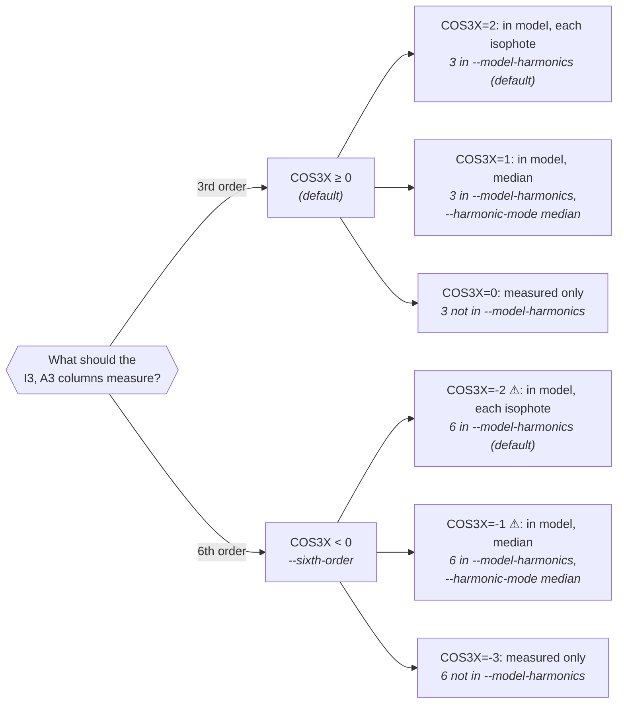
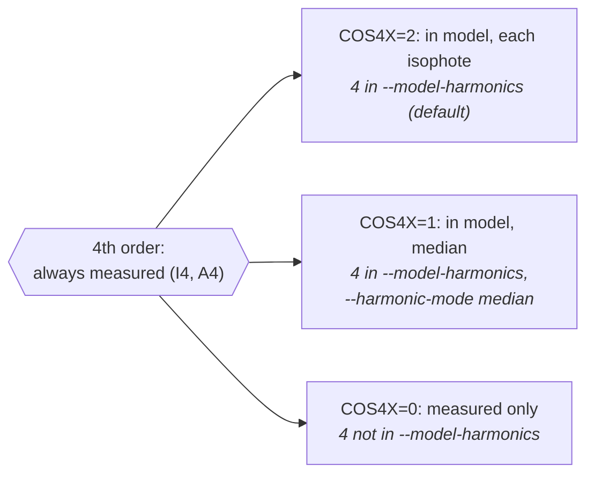

# Harmonic analysis with ELLIPROF

Real isophotes are not perfect ellipses. ELLIPROF measures how each
isophote departs from its best-fitting ellipse with **harmonic terms**:
patterns of extra and missing light that repeat 3, 4 or 6 times around
the ellipse. This page explains what is measured, how to read the
`I3`, `A3`, `I4`, `A4` columns, how the harmonics enter the model image,
and how the original `COS3X` / `COS4X` settings and the modern options
map onto each other.

Everything here was checked against the original Fortran
(`src/original/elliprof.f`: routines FITCONTOUR, ALTER and SYNTHESIZE),
and the behaviour is covered by the test suite.

## Why harmonics?

A smooth elliptical galaxy is described well by nested ellipses. Many
galaxies are not quite that simple, and coherent departures from the
ellipses carry information:

- **boxy or disky isophotes** (4th order), the classic structural
  diagnostic of elliptical galaxies;
- **lopsided or egg-shaped isophotes** (3rd order), for example from an
  off-centre component or an interaction;
- **embedded disks and other components** with a different shape or
  orientation, which show up as harmonic terms that change with radius;
- **6-fold structure** (6th order), a finer shape term.

A detected harmonic does **not** prove a particular physical origin.
The same terms also respond to things that have nothing to do with the
galaxy's shape: dust lanes, spiral arms, a companion, a bright star that
was not masked, a **wrong centre**, a **wrong sky level** or a **poor
mask**. Always look at the residual image and check how the harmonics
behave with radius before interpreting them.

## What ELLIPROF fits

Along each ellipse, ELLIPROF samples the image at equal steps of the
[eccentric angle](isophotes.md#the-eccentric-angle) θ (up to 360
samples) and fits the samples by least squares with **nine terms at
once**:

$$ \ln I(\theta) = c_0 + \sum_{n=1,2,4} \left[c_n\cos n\theta + s_n\sin n\theta\right] + \left[c_m\cos m\theta + s_m\sin m\theta\right] $$

with **m = 3** normally, or **m = 6** in [sixth-order mode](#sixth-order).
(With `LINEAR`, $I$ is fitted instead of $\ln I$.)

- The **1st- and 2nd-order terms** tell ELLIPROF how to move the
  ellipse: the 1st order moves the centre, the 2nd order changes the
  ellipticity and position angle. The constant and the cos 2θ term
  update the isophote intensity `I0`.
- The **3rd/6th- and 4th-order terms are measured and reported**, but
  ELLIPROF does not use them to move the ellipse.

!!! note "Do higher orders affect the fitted geometry?"
    Not directly: only orders 0–2 are used to move the ellipse. But all
    nine terms are solved **simultaneously**, so on an ellipse whose
    samples are incomplete (masked regions, image edges) the terms are
    not independent, and replacing the 3θ terms with 6θ terms can shift
    the fitted lower-order coefficients a little. On UGC 12517, switching
    to sixth order changes the fitted centre and ellipticity by less than
    0.003 pixels and 0.0001 at well-sampled intermediate radii, but by up
    to 0.55 pixels and 0.07 next to the masked nucleus and by up to
    0.9 pixels in the outermost, partly masked isophotes. These numbers
    are an example, not a general error estimate. `COS4X` and the size
    of `COS3X` (0, 1, 2) never change the fit at all.

### The convention

Each harmonic is reported as an amplitude and a phase:

$$ \frac{I(\theta)}{I_0} \approx 1 + I_n \cos\!\big[n(\theta - A_n)\big] $$

| Column | Meaning |
|---|---|
| `I3`, `I4` | amplitude of the 3rd/4th-order term **as a fraction of `I0`** (dimensionless). In the default logarithmic fit, $I_n = e^{\,a} - 1$, where $a = \sqrt{c_n^2 + s_n^2}$ is the amplitude of the $\ln I$ term; for small values this is simply $a$. With `LINEAR`, $I_n = a / I_0$ |
| `A3`, `A4` | the phase in degrees of eccentric angle, $A_n = \tfrac{1}{n}\,\mathrm{atan2}(s_n, c_n)$: the angle of the first maximum. Because a pattern of order n repeats every 360°/n, the phase is reduced to **0–120° for A3** and **0–90° for A4** |
| θ | eccentric angle, 0 at the end of the major axis that points at position angle `alpha` (counter-clockwise from +y; on the image this is the end towards −x) |

`A3` and `A4` are **not position angles**. They say *where around the
ellipse* the extra light is, relative to the major axis.

<figure markdown="span">
  
  <figcaption>SCHEMATIC, deviations exaggerated: what the harmonic orders
  look like. The radial deviation r = a [1 + k cos n(θ − Aₙ)] produces the
  intensity term Iₙ cos n(θ − Aₙ) on the fitted ellipse.</figcaption>
</figure>

!!! warning "In 3rd-order mode, A3 can jump by 60° where the position angle wraps"
    `alpha` is reported in 0–180°. Where the fitted position angle of the
    isophotes crosses 0°/180° (common for a galaxy whose major axis is
    near the y axis, and for nearly round isophotes with an uncertain
    angle), the end of the major axis that θ is measured from swaps to
    the other end, which shifts θ by 180°. The phase of an order-n term
    then shifts by 180°, counted modulo its period 360°/n:

    | Order | Period of the phase | Effect of the 180° swap |
    |---|---|---|
    | 3rd (`A3`, `COS3X` ≥ 0) | 120° | **60° jump in A3** (half a period) |
    | 4th (`A4`) | 90° | none (two whole periods) |
    | 6th (A6) | 60° | none (three whole periods) |

    So **only the ordinary 3rd-order A3** jumps. It is a convention
    effect, not a change in the galaxy. In
    [sixth-order mode](#sixth-order) the `A3` column holds 2 × A6, and
    since A6 does not jump, neither does that column. In the synthetic
    test (a fixed pattern on a galaxy whose angle wraps from 179.9° to
    2.0°), the 3rd-order `A3` goes from 60.2° to 0.4°, while in
    sixth-order mode the `A3` column stays near 0.2° (0.1–0.4°) on both
    sides, and `A4` changes only smoothly with the twist.

## Measuring versus modelling { #the-harmonics-in-the-model-image }

Two separate questions are answered by two separate settings:

1. **Which order is measured?** Always the 4th, and either the 3rd or
   the 6th. This changes the profile columns.
2. **Which measured terms go into the model image?** None, the median
   value over all isophotes, or each isophote's own value (interpolated
   between isophotes). This changes **only the model image and the
   residual**, never the profile.

In the model image the included terms multiply the pure-ellipse model:
model = smooth × [1 + I₃ cos 3(θ − A₃) + I₄ cos 4(θ − A₄)], with θ the
eccentric angle of each pixel on the interpolated ellipse.

## The harmonic modes

This is the authoritative table. Both the original concise settings
(`COS3X=`, `COS4X=`) and the descriptive options are fully supported and
run exactly the same code; the tests check that they give identical
profiles, models and residuals.

### Third or sixth order: `COS3X`

| Legacy | Order measured | In the model | Modern equivalent of this value | Profile columns | Meaning |
|---|---|---|---|---|---|
| `COS3X=2` | 3θ | each isophote's term | 3 in `--model-harmonics` (default) | `I3`, `A3` = 3rd order | measure and model the 3rd order |
| `COS3X=1` | 3θ | median term | 3 in `--model-harmonics`, `--harmonic-mode median` | `I3`, `A3` = 3rd order | model one median 3rd-order term |
| `COS3X=0` | 3θ | none | 3 not in `--model-harmonics` | `I3`, `A3` = 3rd order | measure the 3rd order, keep it out of the model |
| `COS3X=-2` | 6θ | each isophote's term | `--sixth-order`, 6 in `--model-harmonics` (default) | `I3` = 6th-order amplitude, `A3` = 2 × 6th-order phase | measure and model the 6th order |
| `COS3X=-1` | 6θ | median term | `--sixth-order`, 6 in `--model-harmonics`, `--harmonic-mode median` | as above | model one median 6th-order term |
| `COS3X=-3` | 6θ | none | `--sixth-order`, 6 not in `--model-harmonics` | as above | **measure the 6th order only** (recommended for 6th-order diagnostics) |

The **sign** of `COS3X` chooses the order measured (≥ 0: 3rd, < 0:
6th); its **size** chooses the use in the model (0 none, 1 median, 2
each).

The original program documents `COS3X` as 0/1/2 and "`COS3X` < 0: use
cos 6x instead of cos 3x". In the original code, every value ≤ −3
measures the 6th order and leaves it out of the model; the elliprof
package exposes `COS3X=-3` as the supported spelling of that behaviour.
The package deliberately accepts exactly −3, −2, −1, 0, 1 and 2 (and
`COS4X` 0, 1, 2) and refuses other values, although the original code
would treat them like one of these.

### Fourth order: `COS4X`

The 4th order is **always measured** (`I4`, `A4`).

| Legacy | In the model | Modern equivalent of this value |
|---|---|---|
| `COS4X=2` | each isophote's term | 4 in `--model-harmonics` (default) |
| `COS4X=1` | median term | 4 in `--model-harmonics`, `--harmonic-mode median` |
| `COS4X=0` | none | 4 not in `--model-harmonics` |

### Exact equivalences

The modern options always set `COS3X` and `COS4X` **together**:
`--model-harmonics` lists the terms put into the model (`none`, `3`,
`4`, `3,4`; with `--sixth-order` the 6th order is written `6`), and
`--harmonic-mode` applies one mode (each or median) to all of them.
Every combination is one of these legacy pairs, and the tests check that
each pair and its modern spelling give identical profiles, models and
residuals:

| Legacy pair | Modern options |
|---|---|
| `COS3X=2 COS4X=2` | (default), or `--model-harmonics 3,4` |
| `COS3X=2 COS4X=0` | `--model-harmonics 3` |
| `COS3X=0 COS4X=2` | `--model-harmonics 4` |
| `COS3X=0 COS4X=0` | `--model-harmonics none` |
| `COS3X=1 COS4X=1` | `--harmonic-mode median` |
| `COS3X=1 COS4X=0` | `--model-harmonics 3 --harmonic-mode median` |
| `COS3X=0 COS4X=1` | `--model-harmonics 4 --harmonic-mode median` |
| `COS3X=-2 COS4X=2` | `--sixth-order` |
| `COS3X=-2 COS4X=0` | `--sixth-order --model-harmonics 6` |
| `COS3X=-1 COS4X=1` | `--sixth-order --harmonic-mode median` |
| `COS3X=-1 COS4X=0` | `--sixth-order --model-harmonics 6 --harmonic-mode median` |
| `COS3X=-3 COS4X=2` | `--sixth-order --model-harmonics 4` |
| `COS3X=-3 COS4X=1` | `--sixth-order --model-harmonics 4 --harmonic-mode median` |
| `COS3X=-3 COS4X=0` | `--sixth-order --model-harmonics none` |

Four legacy pairs mix the two modes and **have no modern spelling**:
`COS3X=2 COS4X=1`, `COS3X=1 COS4X=2`, `COS3X=-2 COS4X=1` and
`COS3X=-1 COS4X=2`. Use the legacy settings for those. Use either the
legacy settings or the modern options in one command, not both.

The same three runs in both styles:

=== "Modern"

    ```sh
    # pure-ellipse model, harmonics still measured
    elliprof n1234j.fits X0=514 Y0=514 R0=10 R1=450 NR=25 \
        -o n1234.dat -m n1234.prf --model-harmonics none

    # 4th order (boxy/disky) in the model only
    elliprof n1234j.fits X0=514 Y0=514 R0=10 R1=450 NR=25 \
        -o n1234.dat -m n1234.prf --model-harmonics 4

    # measure the 6th order, do not model it
    elliprof n1234j.fits X0=514 Y0=514 R0=10 R1=450 NR=25 \
        -o n1234.dat -m n1234.prf --sixth-order --model-harmonics none
    ```

=== "Legacy (COS3X / COS4X)"

    ```sh
    # pure-ellipse model, harmonics still measured
    elliprof n1234j.fits X0=514 Y0=514 R0=10 R1=450 NR=25 \
        -o n1234.dat -m n1234.prf COS3X=0 COS4X=0

    # 4th order (boxy/disky) in the model only
    elliprof n1234j.fits X0=514 Y0=514 R0=10 R1=450 NR=25 \
        -o n1234.dat -m n1234.prf COS3X=0 COS4X=2

    # measure the 6th order, do not model it
    elliprof n1234j.fits X0=514 Y0=514 R0=10 R1=450 NR=25 \
        -o n1234.dat -m n1234.prf COS3X=-3 COS4X=0
    ```

### Which mode?

For users of the original program, the whole `COS3X` family in one grid
(the size of the value says how the term is used in the model, the sign
which order is measured):

| In the model | Measure 3θ | Measure 6θ | Measure 4θ (always) |
|---|---|---|---|
| each isophote's term | `COS3X=2` (default) | `COS3X=-2` ⚠ | `COS4X=2` (default) |
| median term | `COS3X=1` | `COS3X=-1` ⚠ | `COS4X=1` |
| not in the model | `COS3X=0` | `COS3X=-3` | `COS4X=0` |

The same choices as decision diagrams; in italics, the modern options
that give each value (they set both orders at once, see
[Exact equivalences](#exact-equivalences)):





The two modes marked ⚠ put a 6th-order term into the model and are
subject to the [known PA-wrap limitation](#sixth-order).

## Third order

A 3rd-order term is a pattern that repeats three times around the
ellipse: the isophote is pushed out at one end of the major axis and in
at the other, making it egg- or pear-shaped (see the figure above).
`I3` gives its size and `A3` its orientation.

Smooth, relaxed elliptical galaxies are nearly symmetric, so `I3` is
usually small. A coherent 3rd-order signal over a range of radii points
to a lopsided light distribution: an off-centre component, a tidal
feature, a companion, or a problem such as a centre that is off or an
unmasked source on one side. Random residual structure (noise, faint
sources) gives `I3` and `A3` that change erratically from isophote to
isophote; when `I3` is at the noise level, `A3` is meaningless.

Keep the 3rd order **in the model** (default) when you want the model to
follow the galaxy as closely as possible. Keep it **out** (`COS3X=0`)
when you want the residual to show the asymmetric structure itself.

## Fourth order: boxy and disky isophotes

The 4th-order term is the classic measure of **boxy** and **disky**
isophotes.

<figure markdown="span">
  
  <figcaption>SCHEMATIC, deviations exaggerated. A disky isophote sticks out
  along its axes, so a pure ellipse finds extra light at θ = 0° and 90°.
  A boxy isophote sticks out along the diagonals, at 45°.</figcaption>
</figure>

| `A4` near | Extra light on the ellipse | Shape |
|---|---|---|
| 0° (≡ 90°) | along the major and minor axes | **disky** (pointed, "lemon-shaped") |
| 45° | along the diagonals | **boxy** (squared-off) |

`A4` = 0° and `A4` = 90° are the same pattern, because
cos 4(θ − 90°) = cos 4θ: a 4th-order pattern repeats every 90°. Moving
`A4` from 0° to 45° rotates the pattern by half a period and turns
"pointed along the axes" into "pointed along the diagonals". `I4` gives
the size of the deviation; it is always positive, and **the sign of the
boxy/disky shape is in the phase**, not in `I4`.

### Converting to a4/a { #the-conventional-a4a }

In the literature, boxiness is usually quoted as **a4/a**: the cos 4θ
coefficient of the isophote's *radial* deviation from the ellipse,
divided by the semi-major axis, positive for disky and negative for
boxy isophotes. ELLIPROF measures an *intensity* deviation along a fixed
ellipse instead, and the local intensity gradient converts one into the
other.

If the isophote lies a small distance δr outside the ellipse at some θ,
the ellipse there samples slightly brighter light:
δ ln I ≈ (−slope) · δr / r, with slope = d ln I / d ln r (negative for a
galaxy). With δ ln I ≈ I₄ cos 4(θ − A₄), the cos 4θ part of δr/r is

$$ \frac{a_4}{a} \approx \frac{I_4\cos(4A_4)}{-\,\text{slope}} $$

and every term is in the profile (`I4`, `A4`, `slope`). It is a
**first-order approximation**: it assumes small deviations, uses
ELLIPROF's finite-difference slope, takes $e^{a}-1 \approx a$, and
follows this sign convention (other programs differ). It is not the
`I4` column itself.

<figure markdown="span">
  
  <figcaption>SYNTHETIC galaxies with known a4/a = +0.03, 0 and −0.03,
  fitted by elliprof, are recovered as +0.030, 0.000 and −0.030 by the
  formula above.</figcaption>
</figure>

The same reasoning gives $a_3/a \approx I_3\cos(3A_3)/(-\text{slope})$
for the 3rd order, but its sign depends on which end of the major axis
θ is measured from (see the A3 warning above).

!!! warning "Other programs, other conventions"
    Other isophote-fitting programs report the 4th-order term with
    different normalisations and sign conventions (for example, a "B4"
    intensity coefficient, or a radial coefficient divided by a gradient).
    Convert every catalogue to a4/a before comparing.

## Sixth order { #sixth-order }

A 6th-order term repeats six times around the ellipse: six small lobes,
finer than the 4th-order box/disk pattern (see the first figure).

ELLIPROF measures it **in place of** the 3rd order, using the same two
fitting slots and the same output columns. That is why it is selected by
a negative `COS3X` (`--sixth-order`).

!!! warning "In sixth-order mode, I3 and A3 are not 3rd-order quantities"
    There are **no I6 or A6 columns**. With `COS3X` < 0:

    - `I3` holds the **6th-order amplitude** (fraction of `I0`);
    - `A3` holds **twice the 6th-order phase**: A3 = 2 × A6, in 0–120°
      (A6 itself is in 0–60°);
    - the 3rd order is not measured at all;
    - the 3rd-order rule that `A3` jumps by 60° at a position-angle wrap
      **does not apply**: neither A6 nor this `A3` column jumps
      ([see above](#the-convention)).

    ELLIPROF's printed table labels the columns `I(6x)` and `A(6x)` in this
    mode. The `.dat` profile and the CSV keep the column names `I3`, `A3`;
    the CSV adds a header line saying `Harmonic order: 6`, and the profile
    records the negative `COS3X` in its run settings
    (`read_profile(...).attrs["flags"]`).

Because A3 = 2 A6, the argument 6 A6 is 3 A3, and the radial 6th-order
deviation is

$$ \frac{a_6}{a} \approx \frac{I_3\cos(3A_3)}{-\,\text{slope}} \qquad (\text{sixth-order mode only}). $$

Sixth order changes what is **measured**, and through the simultaneous
fit it can change the fitted geometry a little where an ellipse is
poorly sampled (see [What ELLIPROF fits](#what-elliprof-fits)). Whether
the 6th-order term also goes into the **model** is chosen by the size of
`COS3X`, as for the 3rd order.

!!! danger "Known limitation of the original code: sixth-order models across a position-angle wrap"
    If the fitted position angle of the isophotes crosses the 0°/180°
    boundary, the original model synthesis (SYNTHESIZE) gives the
    6th-order term the **wrong sign beyond that radius**. It corrects the
    phase for the swapped end of the major axis in a way that is right for
    the 3rd order but not for the 6th.

    - The **measured** 6th-order profile (`I3`, `A3`) is correct on both
      sides of the wrap.
    - The **model and the residual** are wrong beyond the wrap in the two
      modes that put the 6th order into the model: `COS3X=-2`
      (`--sixth-order`) and `COS3X=-1` (`--sixth-order --harmonic-mode
      median`). There the 6th-order structure is subtracted with the wrong
      sign, so the residual holds about twice the signal instead of none.
    - elliprof **warns** when this happens (it names the isophote where
      the angle wraps), and does not change the model: the original
      numerical code is kept exactly as it is.
    - **Measurement only, `COS3X=-3` (`--sixth-order --model-harmonics
      none`), avoids the problem** and is the recommended mode for
      6th-order diagnostics.

    UGC 12517 is affected: in its sixth-order fit the angle wraps already
    at the 2nd isophote (11.7 pixels), so almost the whole 6th-order model
    is affected (elliprof's warning names that isophote). This is
    pre-existing behaviour of the original ELLIPROF, not something
    introduced by the package.

<figure markdown="span">
  
  <figcaption>SYNTHETIC test of the limitation. Inside the wrap the
  6th-order model term removes the 6th-order structure (0); beyond it the
  structure is subtracted with the wrong sign (≈ 2). The 3rd order in the
  same geometry is handled correctly.</figcaption>
</figure>

A second, older observation: with a 6th-order term in the model, the
model can have a few NaN pixels at the very centre, inside the innermost
isophote.

## Modelling the harmonics: a controlled example

On synthetic galaxies whose isophotes carry a known 2% radial deviation
of order 3, 4 or 6, elliprof recovers the deviation (0.0200, 0.0200 and
0.0199 through the formulae above), the other orders stay at the noise
level (no cross-talk), and putting the matching term into the model
removes about 98% or more of that pattern from the residual:

<figure markdown="span">
  
  <figcaption>SYNTHETIC: residual = science − model without (top) and with
  (bottom) the matching harmonic term in the model.</figcaption>
</figure>

Real galaxies are rarely this clean: noise, masks, dust and several
components all mix into the measured terms.

## Real data: UGC 12517

<figure markdown="span">
  
  <figcaption>REAL DATA: the harmonic columns of the UGC 12517 fit (the
  unfitted innermost isophote, inside the masked nucleus, is left
  out).</figcaption>
</figure>

- `I4` is about 0.002–0.007 and `A4` mostly 40°–55°, so a4/a is between
  about −0.005 and +0.001: nearly pure ellipses, if anything slightly
  boxy.
- `I3` is about 0.001–0.003 at intermediate radii. At that level `A3`
  is not well determined, and it scatters over its whole range.
- The innermost fitted isophote (11.7 pixels) borders the masked nucleus
  and the outermost ones are faint and partly masked; treat their
  harmonics with care.

!!! researcher "Significance"
    ELLIPROF's profile does not include uncertainties. A deviation of a
    few tenths of a percent is small. Before interpreting it, estimate the
    noise, for example by refitting with different masks, sky levels or
    starting parameters, or by fitting simulated images with the same
    noise.

The harmonics change the model image of UGC 12517 by a small,
structured amount (the fitted profile is identical in all three runs):

<figure markdown="span">
  
  <figcaption>REAL DATA: UGC 12517 models with and without the harmonic
  terms.</figcaption>
</figure>

## Harmonics and SBF distances

For [surface brightness fluctuation](../sbf/index.md) work, the smooth
galaxy model is subtracted and the fluctuations are measured in the
residual. A model with the wrong shape leaves **coherent residual
structure**: four-fold "butterfly" patterns from boxy or disky
isophotes, an embedded disk, or large-scale asymmetric patterns. Such
structure adds power at low spatial frequencies and can bias the
fluctuation measurement, so the harmonic terms in the model matter.

More terms are not automatically better. A harmonic term can absorb real
structure that should be masked or studied (dust, spiral arms, a
companion), or compensate for a wrong sky level, mask or centre.
Choose the model harmonics by looking at the profile (are the terms
coherent with radius?), the residual image, and how the result changes
between settings. ELLIPROF provides the galaxy model and residual; the
fluctuation analysis itself is done downstream (see
[ELLIPROF's role in SBF](../sbf/elliprof-role.md)).

## Why it matters

The 4th-order shape of elliptical galaxies correlates with other
properties. Disky ellipticals tend to be rotation-supported and of lower
luminosity. Boxy ellipticals tend to be more luminous, slowly rotating,
and more often radio-loud and X-ray bright. This was the basis of
Kormendy & Bender's (1996) proposal to divide ellipticals into disky and
boxy types. See Kormendy, Fisher, Cornell & Bender (2009) for a detailed
study. Harmonic analysis of isophotes goes back to work including
Jedrzejewski (1987).

- Jedrzejewski, R. I. 1987, MNRAS, 226, 747, [doi:10.1093/mnras/226.4.747](https://doi.org/10.1093/mnras/226.4.747)
- Kormendy, J. & Bender, R. 1996, ApJ, 464, L119, [doi:10.1086/310095](https://doi.org/10.1086/310095)
- Kormendy, J., Fisher, D. B., Cornell, M. E. & Bender, R. 2009, ApJS, 182, 216, [doi:10.1088/0067-0049/182/1/216](https://doi.org/10.1088/0067-0049/182/1/216)

See also: [How ELLIPROF fits a galaxy](how-it-works.md),
[the command-line reference](../reference/cli.md#model-and-harmonics),
[UGC 12517, step by step](../tutorials/u12517.md).
