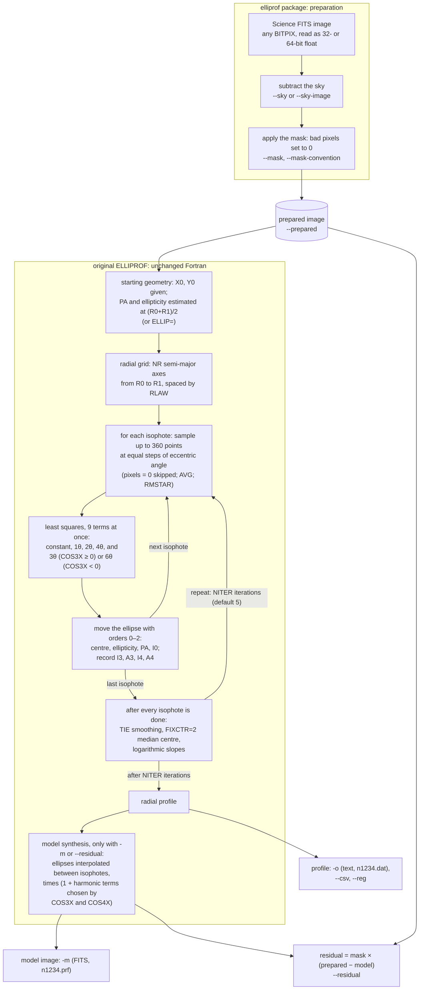

# How ELLIPROF fits a galaxy

This page describes what ELLIPROF does between reading your image and
writing the profile, and which parameters control each step. The keyword
names (`NITER=`, `RLAW=` ...) are the same on the command line and, in
lower case, in Python.

## Overview

1. **Prepare the image:** `prepared = mask × (science − sky)`.
   ([Sky and masks](sky-and-masks.md))
2. **Choose the radii:** `NR` semi-major axes from `R0` to `R1`, spaced
   by `RLAW`.
3. **Start** every isophote at your initial centre (`X0`, `Y0`), with a
   rough position angle and ellipticity. ELLIPROF estimates these from
   the image at the half-way radius (R0 + R1)/2; with `ELLIP=e` it uses
   your ellipticity instead.
4. **Iterate** `NITER` times. In each iteration, for every isophote:
    - sample the image along the current ellipse (up to 360 points);
    - optionally reject bright star-like samples (`RMSTAR`);
    - fit the intensity around the ellipse with a constant plus harmonics
      of orders 1, 2, 4 and 3 (or 6), all at once;
    - use the 1st- and 2nd-order terms to move the centre and to change
      the ellipticity and position angle, so that the ellipse follows the
      isophote.

    Then update the logarithmic slopes of all the isophotes.

5. **Write** the profile and, when `-m` (or `--residual`) asks for it,
   build the model image.

## The workflow

The steps in the first box, and the files written at the end, are done
by the **elliprof package** around the original program: reading any
FITS data type, subtracting the sky, applying the mask, and writing the
profile, model, prepared and residual files. The steps in the second box
are the **original ELLIPROF** routines (FITPROFILE,
GETCONTOUR, TRIMIT, FITCONTOUR, ALTER and SYNTHESIZE in
`src/original/elliprof.f`), compiled unchanged. Between the fit and the
model, ELLIPROF also fits a de Vaucouleurs law to the profile and prints
the result; it is not used for the model.

**One iteration** visits every isophote once (sample, fit, move the
ellipse), then smooths the parameters if `TIE` is set and updates the
slopes. `NITER=n` or `--niter n` sets how many iterations are run; the
default, 5, is the original program's own.

## 1. The initial centre and the fitted centres

**ELLIPROF does not find the galaxy for you.** You give the starting
centre `X0`, `Y0`. Every isophote then fits its own centre, which is
reported as `x0`, `y0` in the profile.

<figure markdown="span">
  
  <figcaption>UGC 12517 (real fit). Starting from X0=567, Y0=562, each
  isophote finds its own centre. The inner ones agree to a fraction of a
  pixel. The outer ones move by up to 1.5 pixels, where the galaxy is
  faint and large areas are masked.</figcaption>
</figure>

| `FIXCTR=` | Centres |
|---|---|
| 0 (default) | each isophote fits its own centre |
| 1 | all centres fixed at `X0`, `Y0` |
| 2 | after each iteration, all centres are set to the median of the fitted centres |

**ELLIPROF pixel coordinates**

ELLIPROF puts the centre of the pixel in FITS column *i* at
x = *i* − 0.5, and likewise for rows. That is **half a pixel less than
FITS and DS9 pixel numbers**. A galaxy centred on DS9 pixel (567.5,
562.5) has ELLIPROF centre (567, 562). The DS9 region files that
elliprof writes are already converted.

A poor starting centre (off by more than a few pixels, or on a star) can
make the inner isophotes wander. Give the best centre you can, and check
the `x0`, `y0` columns.

## 2. The radii: R0, R1, NR and RLAW

`R0` and `R1` are the semi-major axes, in pixels, of the innermost and
outermost isophotes (0 < R0 < R1). `NR` (2 to 100) is the number of
isophotes, including both ends. `RLAW` decides how they are spaced:

| `RLAW=` | Spacing |
|---|---|
| 2 (default) | equal steps in $r^{1/4}$ |
| 1 | equal steps in $\log r$ (geometric) |
| 0 | equal steps in $r$ (linear) |

<figure markdown="span">
  
  <figcaption>The semi-major axes for R0=9, R1=347, NR=23. The RLAW=2 values
  are exactly those of the UGC 12517 fit.</figcaption>
</figure>

The default $r^{1/4}$ spacing samples the bright inner galaxy closely
without wasting isophotes in the faint outskirts. It suits the
de Vaucouleurs-like profiles of elliptical galaxies.

## 3. Sampling one ellipse

Along each ellipse ELLIPROF takes up to 360 samples at equal steps of the
[eccentric angle](isophotes.md#the-eccentric-angle). By default each
sample is interpolated bilinearly between the four nearest pixels. With
`AVG=n`, it is instead a weighted average over a (2n+1) × (2n+1) box, and
samples with more than 20% masked weight are skipped. Pixels that are
exactly 0 are ignored. That is how the [mask](sky-and-masks.md) acts.

If an ellipse has too few usable samples (for example, it lies inside a
masked region), that isophote keeps its previous parameters, and elliprof
reports it in a note.

## 4. Fitting the harmonics

The samples around the ellipse are fitted by least squares, all nine
terms at once, with

$$ \ln I(\theta) = c_0 + \sum_{n=1,2,4}\left[a_n\cos n\theta + b_n\sin n\theta\right] + \left[a_m\cos m\theta + b_m\sin m\theta\right] $$

by default, where m = 3, or m = 6 with `--sixth-order` (`COS3X` < 0).
With `LINEAR`, $I$ itself is fitted instead of $\ln I$.

- **Orders 1 and 2** measure how the ellipse is off: a 1st-order term
  means the centre is off, and a 2nd-order term means the ellipticity or
  position angle is off. ELLIPROF converts them into corrections and
  moves the ellipse. The constant and the cos 2θ term update `I0`.
  `GAIN=g` scales the corrections, and `ELLIP=e` holds the ellipticity
  fixed.
- **Orders 3 (or 6) and 4** are measured and reported as `I3`, `A3`,
  `I4`, `A4`, and are not used to move the ellipse. Because all nine terms
  are solved together, the 3rd/6th-order choice can still shift the
  fitted geometry slightly where an ellipse is poorly sampled. See
  [Harmonic analysis](harmonics.md).

After each iteration, the **logarithmic slope** of every isophote is
updated from its neighbours:

$$ \text{slope}_k = \frac{I_{k-1} - I_{k+1}}{I_k}\,\frac{r_k}{r_{k-1} - r_{k+1}} \approx \frac{d\ln I}{d\ln r} $$

At the first and last isophotes this becomes a one-sided difference.
Positive values (intensity increasing outwards) are replaced by −2.

## 5. Iterations: NITER

One iteration visits every isophote once. `NITER` (default 5, 1 to
1000) sets how many iterations are run; on the command line `--niter N`
is the same as `NITER=N`, and in Python it is `niter=`. The default of 5
is the original ELLIPROF's own. Increase it when the parameters are still
changing between the last iterations, for example after a poor starting
centre. The keyword `VERBOSE` prints the parameters after every
iteration, so you can see whether they have settled.

`NITER` is the only iteration count of the isophote fit. The original
code has fixed internal limits elsewhere (for example in the
de Vaucouleurs fit it prints at the end), but they do not affect the
profile, the model or the residual, and they are not parameters.

`TIE=k` smooths the parameters with radius after each iteration. With
k ≥ 0 it fits a weighted polynomial of order k in $r^{1/4}$. With k < −1
it takes a running binomial average over |k| isophotes. The default,
−1, applies no smoothing.

## 6. Rejecting stars: RMSTAR

With `RMSTAR`, the samples along each ellipse that are brighter than

$$ \text{median} + 4\times(Q_3 - \text{median}) $$

($Q_3$ is the upper quartile) are ignored in that iteration. Only
**bright** outliers are rejected, one sample at a time.

<figure markdown="span">
  
  <figcaption>The RMSTAR rule applied, for illustration, to one real
  UGC 12517 isophote <em>without</em> the mask. It catches the stars and the
  edge of a background galaxy that the ellipse crosses. In the real fit,
  the mask removes most of these first.</figcaption>
</figure>

!!! researcher "RMSTAR is not a substitute for a mask"
    The original code also intends to drop the samples next to each
    rejected one, but that loop has no effect, so only the bright samples
    themselves go. The wings of a star below the threshold stay in the
    fit. Mask extended or bright contaminants with `--mask`, and use
    `RMSTAR` for faint stars and knots that the mask missed.

## 7. The model image

With `-m FILE`, ELLIPROF builds a 2-D model of the galaxy from the fitted
isophotes and elliprof writes it as FITS (no `MODEL` keyword is needed
since 0.1.4). The model is built after the fit is finished, so asking for
it never changes the profile. The model follows the fitted
intensity, centre, ellipticity and position angle with radius, plus the
3rd- and 4th-order terms you choose ([model harmonics](harmonics.md#the-harmonics-in-the-model-image)).
It covers the whole image, masked pixels included.

**Inside R0 and beyond R1**

The model also has values inside the innermost and beyond the
outermost fitted isophote, where it is extrapolated from the profile.
Only the region between R0 and R1 is constrained by the fit.

## Other keywords

| Keyword | Effect |
|---|---|
| `SCALE=s` | image scale in arcsec/pixel; only recorded in the profile |
| `SKY=s` | ELLIPROF's own sky level, used **only** by the de Vaucouleurs fit printed at the end. It does not change the image or the profile. Use `--sky` to subtract a sky |
| `GC` | globular-cluster mode: circular annuli around a centre that ELLIPROF finds itself |

See the [command-line reference](../reference/cli.md) for everything.
